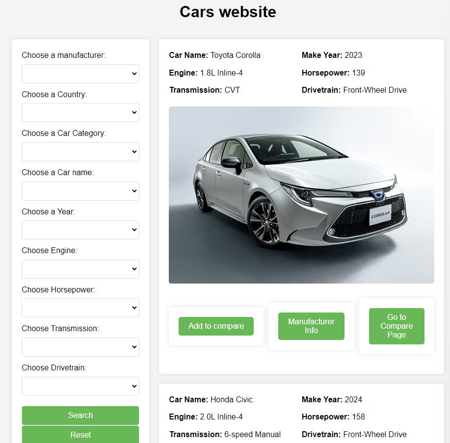
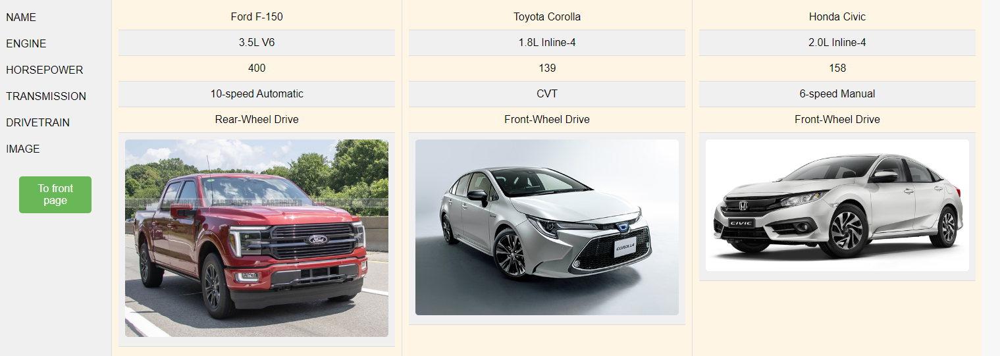

# Car Comparison Web Application Documentation

## Overview

This web application allows users to view, search, and compare different car models. It provides a user-friendly interface to filter cars based on various criteria and view detailed manufacturer information.

## Features

- **Home Page**: Displays all available car models and a search bar for filtering.
- **Search Functionality**: Users can filter cars by manufacturer, country, category, name, year, engine, horsepower, transmission, and drivetrain.
- **Comparison Page**: Users can add cars to a comparison list and view them side by side.
- **Manufacturer Details**: Users can view detailed information about the car manufacturers.

## Technical Structure

### Server Initialization

The server is set up to listen on port `8081`. It serves static files from the `frontend` and `api` directories and registers route handlers for various endpoints.

### Route Handlers

- `"/"`: Renders the home page with search functionality.
- `"/sbar"`: Processes search queries and updates the car list based on the search criteria.
- `"/compare"`: Adds selected cars to the comparison list.
- `"/comparepage"`: Renders the comparison page with the user's selected cars.
- `"/manufacturer"`: Provides detailed information about a specific manufacturer.

### Helper Functions

- `parseFormValueInt`: Converts form string values to integers for processing.

### Frontend

Under here we find three .html files :

- `"index"`: Web template for servers home page
- `"comparepage"`: Web template for servers comparison page
- `"manufacturer"`: Web template for servers manufacturer page

and three .css files for the correspondig web templates

## Local Packages

### Searchbars

#### Functions

- `"ManElement"`: Function that data from api to Manufacturesrs struct.
- `"CatElement"`: Function that data from api to Cat struct.
- `"ModelsElement"`: Function that data from api to Models struct.
- `"FindSearch"`: removes double values for searchbar.
- `"FilterSearch"`: If user uses search, this function filters the unwanted models out
- `"FilterManufacturer"`: This function pinpoints the manufacturer info for the manufacturer page

#### Helper Functions

- `"FetchData"`: It helps other functions to read from Json API

## Usage Guide

1. **Starting the Server**: Run the API server [API server guide](api/README.md) after run main serverto start the server.
 <>
2. **Viewing Cars**: Go to the home page([localhost](http://localhost:8081/) for default port) to see all available cars. You will be greeted to this kind of page
3. **Filtering Cars**: Use the search bar to filter cars based on specific criteria.

4. **Comparing Cars**: Select cars to compare and navigate to the comparison page to view them side by side.

 

5. **Viewing Manufacturer Info**: Click on a manufacturer to get more detailed information.

## Development Setup

Make sure you have the following dependencies installed:
- Go programming language
- For this program to wirk correctly you need to run the API server first. More [API server guide](api/README.md)